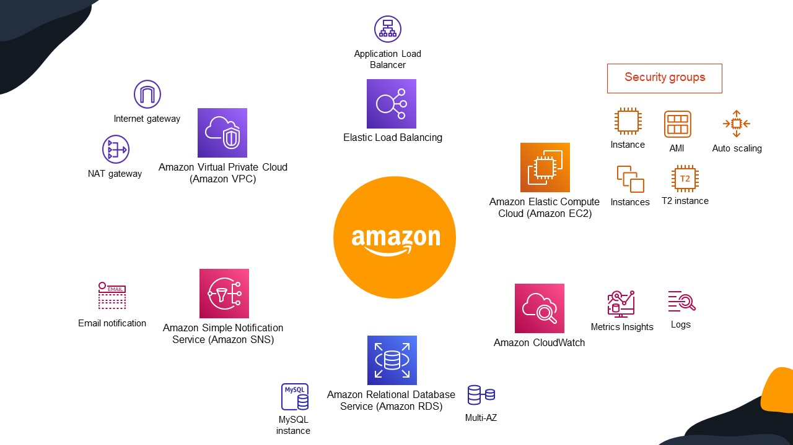

# AWS Cloud Foundations Project
## Welcome

## Introduction
In this project we’re trying to deploy a ready PHP web-app which is a chat application where our objective is make it **scalable**, **fault tolerant**, **faster** and able to handle **thousands of requests** at the same time then a normal deployment.
To deal with that, we've used the **AWS cloud** platform which offers a lot of services,  
>**Note That!** services in the Learner Lab are restricted, so I tried to use the things that I understood well from AWS Academy course "Cloud Foundations" 

In our case we’ve used the following services that AWS offer:

