# AWS Cloud Foundations Project


## **Introduction**

In this project we tried to deploy a ready PHP web-app which is a chat application where our objective is make it **scalable**, **fault tolerance**, **faster** and able to handle **thousands of requests** at the same time then a normal deployment.
To deal with that, we've used the **AWS cloud** platform which offers a lot of services,

> **Note That!** services in the Learner Lab are restricted, so I tried to use the things that I understood well from AWS Academy course "Cloud Foundations"

In my case I’ve used the following services:


## **Deployment Architecture**

The following figure represents a global overview about the design that I did

> For that I used [draw.io](https://app.diagrams.net/?splash=0&libs=aws4) which offers all AWS design components.  
> More tools visit [AWS Architecture Icons](https://aws.amazon.com/architecture/icons/)

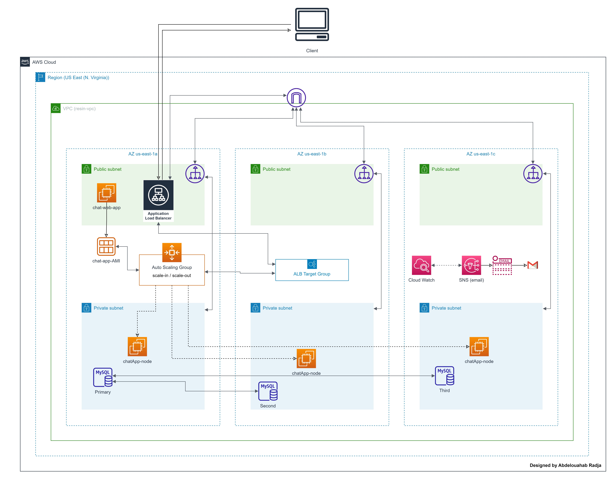

> The end-user can only interact with the ALB "Application Load Balancer" nothing more.

## **Network Topology**

The following screenshot represents my VPC topology where the name "**resin**" is my vpc name  
There are 3 AZ us-east-1a, us-east-1b, us-east-1c where each one contains two subnets one is public and the second is private

- **private subnet**: contains EC2, DB instances
- **public subnet**: contains only NAT gateway wich is connected directly to the vpc internet gateway, also will be pointed by the load balancing purpose

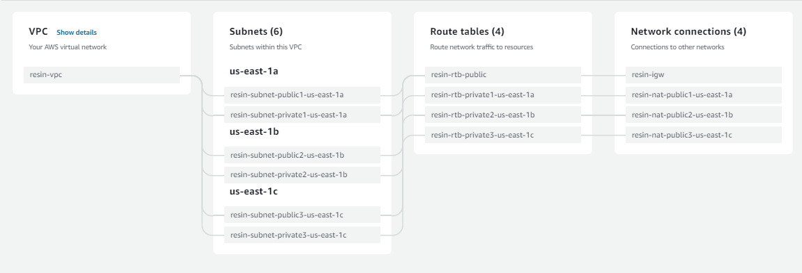

## **Security Groups**

As a convention I saw that creating security groups before launching any EC2 instances, ALB etc. will be easy so later I only need to attach them to their dedicated instances.

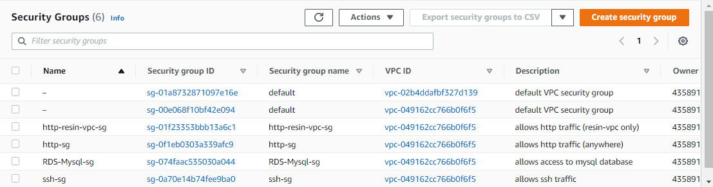

### **Security Groups Description**

- **http-resin-vpc**
  - Allows only in/out http local traffic, which will be attached to ec2 instances
    > **note that!** EC2 instances(web servers) are not accessed from out side
- **http-sg**
  - Allows in/out http traffic (anywhere), which will be attached only to the Application Load Balancer
- **RDS-Mysql-sg**
  - Allows in/out mysql traffic inside my vpc, since DB servers are not accessed from out side
- **ssh-sg**
  - Allows in/out ssh traffic anywhere, which I use to access and configure my EC2 instances from my laptop

## **EC2 Configuration (Web Server)**

In my case I used t2.micro ubuntu instance, initially I attached to security groups (ssh-sg and hhtp-sg).

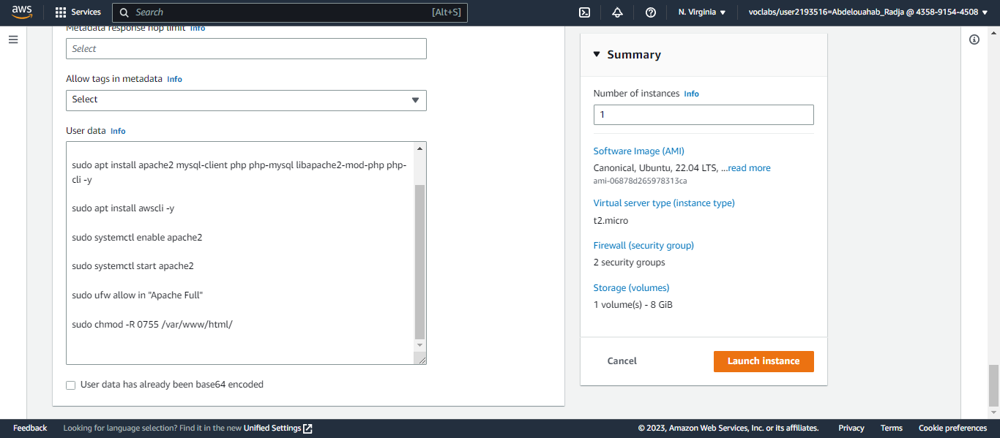

In addition to that I put a bash script which excutes at the startup of the instance to update and install the required tools that I need such as apache, php and mysql-client not mysql-server because I'm gonna connect the instance to RDS instance

```
#!/bin/bash
sudo apt update
sudo apt install apache2 mysql-client php php-mysql libapache2-mod-php php-cli -y
sudo apt install awscli -y
sudo systemctl enable apache2
sudo systemctl start apache2
sudo ufw allow in "Apache Full"
sudo chmod -R 0755 /var/www/html/
```

## **RDS Configuration (MysqlDB)**

In our case we used Mysql Community Server provided by AWS, so no need to worry about maintenance, fault tolerance etc.  
The deployed Model used is Multi-AZ where our primary DB resides in AZ us-east-1a and for readonly instances they reide in us-east-1b and us-east-1c.

> Note that database name is **chatappdb** as shown below

The following is overview about the DB used.
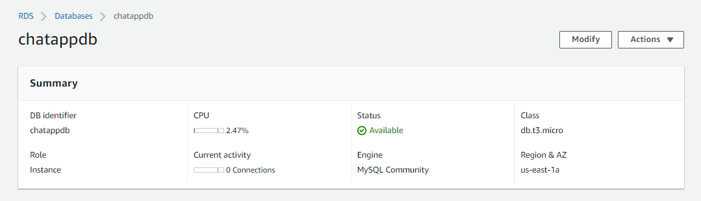

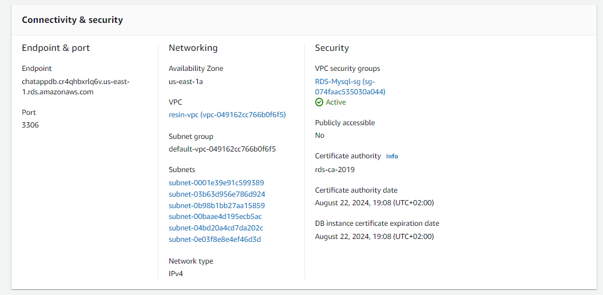

## **AMI Configuration**

Before we start setting up our auto-scale policies, first we need to create our **AMI** (Amazon Maching Image) to let our auto-scale use it for creating new EC2 instances when needed.

The following figure represents our AMI which is a snapshot from the first EC2 we made at the first time.
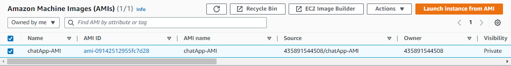

> Knowing that security groups that are attached to it are: **http-resin-vpc** and **RDS-Mysql-sg**

## **Load Balancer Configuration**

Load balancer is one of the most important stuff that makes our App fault tolerant, in our case we used ALB which stands for "Application Load Balancer" but before we configure that, and ALB requires a target group where it contains the list of the healthy instances to redirect the request of end-user there.  
The following figure shows the configuration of the target group

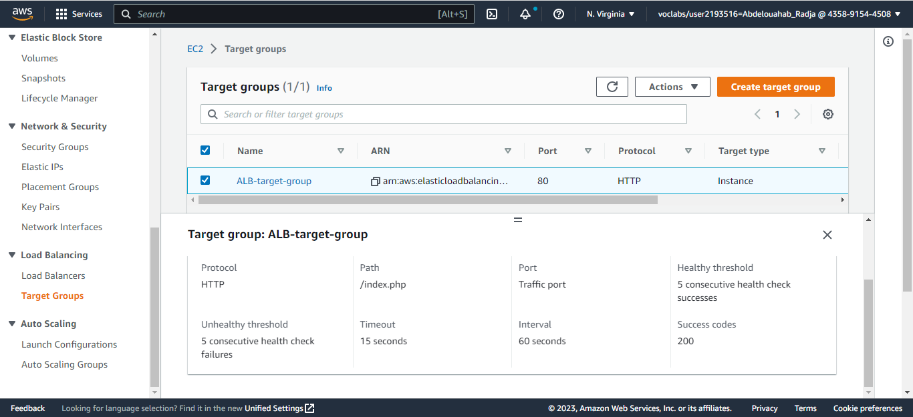

> **Note that!** the health check policy used in this case is called **ELB check** which means if the web server broken down or home page is not reached then the instance will be considered as unhealthy. which is preferable than instance check where it checks only the running state of the instance

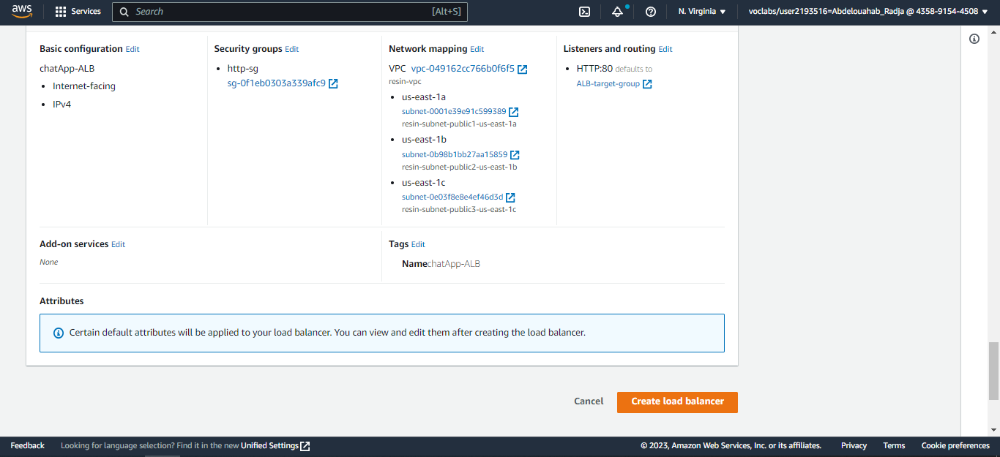

## **Auto Scaling**

Our auto-scale called **chatApp-auto-scale**, we use that alongside with the application load balancer to make our web application able to **scale in/out** depends on **"cpu load"** criterion which we used in our case.  
knowing that we define more conditions for scaling.

> ChatApp AMI has been used by the auto-scale to create dynamically new instances.

For the group we can setup the following capacities desired, minimum and maximum depends on our budget.

### **Attach AMI for the auto-scale**

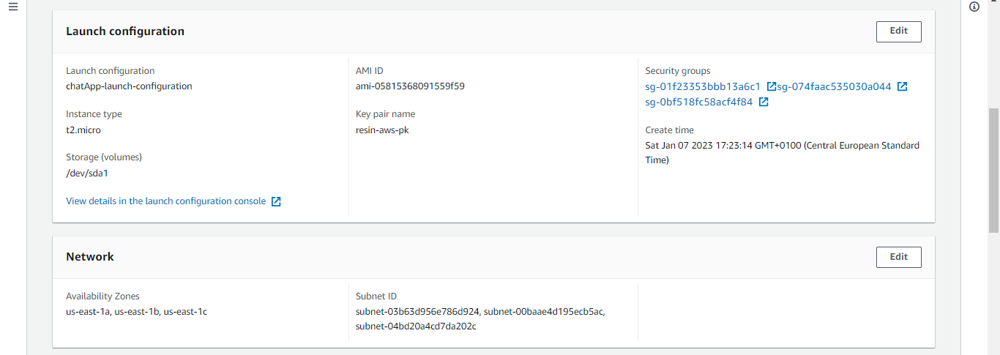

### **Setting up scale range**

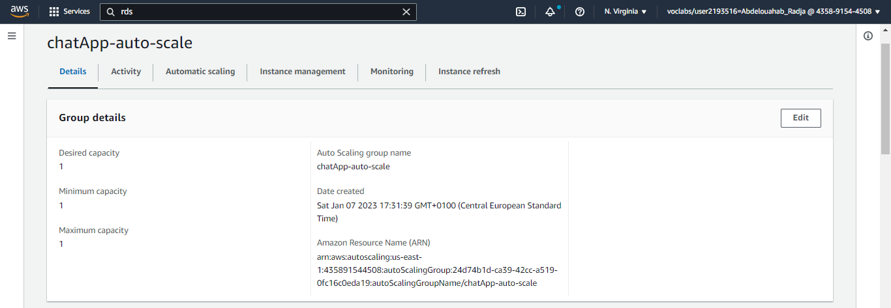

### **Attach ALB with auto-scale**

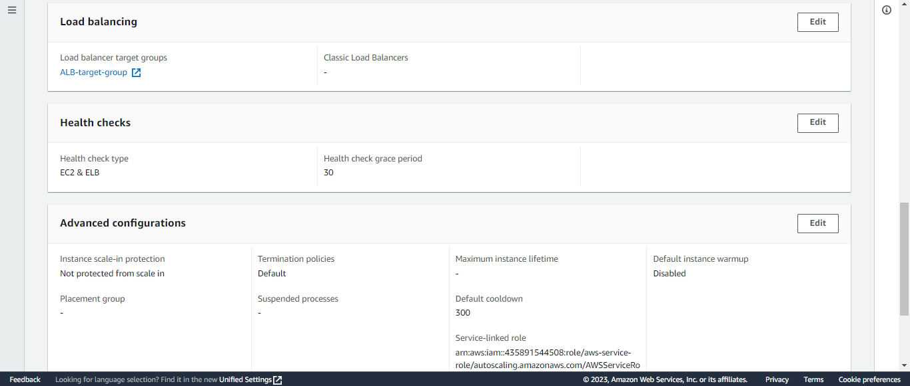

## **Accessing The Application**

Finally we access our web-app using the ALB url.

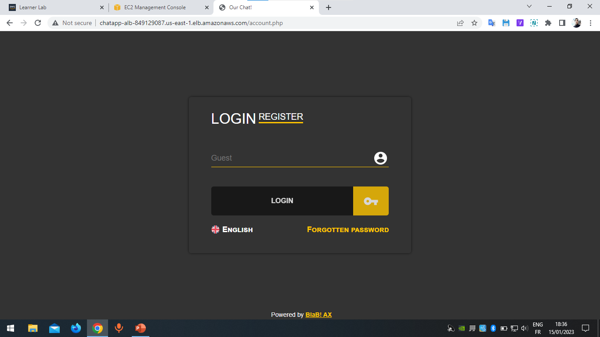
\
\
